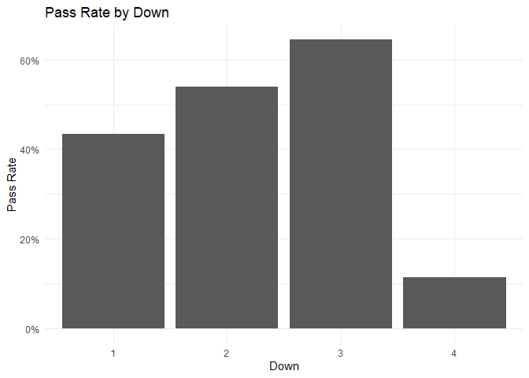

Analysis on NFL Play-By-Play Data
================
Nathan Krieger, Caleb Moe

``` r
pbp <- readr::read_csv("https://nflsavant.com/pbp_data.php?year=2024")
```

    ## New names:
    ## Rows: 53283 Columns: 45
    ## ── Column specification
    ## ──────────────────────────────────────────────────────── Delimiter: "," chr
    ## (10): OffenseTeam, DefenseTeam, Description, Formation, PlayType, PassT... dbl
    ## (29): GameId, Quarter, Minute, Second, Down, ToGo, YardLine, SeriesFirs... lgl
    ## (5): ...11, ...13, ...17, ...18, Challenger date (1): GameDate
    ## ℹ Use `spec()` to retrieve the full column specification for this data. ℹ
    ## Specify the column types or set `show_col_types = FALSE` to quiet this message.
    ## • `` -> `...11`
    ## • `` -> `...13`
    ## • `` -> `...17`
    ## • `` -> `...18`

**Introduction**

The NFL has become increasingly data-driven, and play-by-play (PBP)
information provides one of the richest views into how teams behave on
the field. In recent years, analysts have used PBP data to uncover
trends such as fourth-down aggression, pass-rate over expectation, route
combinations, motion usage, and situational efficiency.

Our project explores play-by-play trends across the NFL, focusing on how
offensive decision-making and performance vary by:

Down & distance

Field position

Play type (run/pass)

Quarter & game situation

Score differential

Team tendencies

The goal is to identify meaningful behavioral patterns and performance
outcomes that can help explain how modern offenses operate.

We also evaluate the robustness of our findings with multiple approaches
and highlight unintuitive results requiring further investigation.

**Data**

Our analysis uses play-by-play data from NFLsavant.com, a publicly
accessible resource containing detailed information for every offensive
snap. The dataset includes 45 variables such as:

GameId

Quarter

Minute

YardLine

Formation

And many more…

``` r
head(pbp)
```

    ## # A tibble: 6 × 45
    ##      GameId GameDate   Quarter Minute Second OffenseTeam DefenseTeam  Down  ToGo
    ##       <dbl> <date>       <dbl>  <dbl>  <dbl> <chr>       <chr>       <dbl> <dbl>
    ## 1    2.02e9 2024-12-29       3      7      3 GB          MIN             1    10
    ## 2    2.02e9 2024-12-29       3      9     44 MIN         GB              0     0
    ## 3    2.02e9 2024-12-29       3      9     44 MIN         GB              0     0
    ## 4    2.02e9 2024-12-29       3      9     50 MIN         GB              1    10
    ## 5    2.02e9 2024-12-29       3     15      0 MIN         GB              0     0
    ## 6    2.02e9 2024-12-29       2      2      0 GB          MIN             0     0
    ## # ℹ 36 more variables: YardLine <dbl>, ...11 <lgl>, SeriesFirstDown <dbl>,
    ## #   ...13 <lgl>, NextScore <dbl>, Description <chr>, TeamWin <dbl>,
    ## #   ...17 <lgl>, ...18 <lgl>, SeasonYear <dbl>, Yards <dbl>, Formation <chr>,
    ## #   PlayType <chr>, IsRush <dbl>, IsPass <dbl>, IsIncomplete <dbl>,
    ## #   IsTouchdown <dbl>, PassType <chr>, IsSack <dbl>, IsChallenge <dbl>,
    ## #   IsChallengeReversed <dbl>, Challenger <lgl>, IsMeasurement <dbl>,
    ## #   IsInterception <dbl>, IsFumble <dbl>, IsPenalty <dbl>, …

``` r
# Pass Rate By Down

pbp %>%
  filter(Down %in% 1:4) %>%
  group_by(Down) %>%
  summarize(pass_rate = mean(IsPass == 1, na.rm = TRUE)) %>%
  ggplot(aes(x = factor(Down), y = pass_rate)) +
  geom_col() +
  labs(
    title = "Pass Rate by Down",
    x = "Down",
    y = "Pass Rate"
  ) +
  scale_y_continuous(labels = scales::percent_format()) +
  theme_minimal()
```

<!-- -->

``` r
# Pass vs Run by Field Position

pbp %>%
  filter(YardLine >= 1, YardLine <= 99) %>%
  group_by(YardLine) %>%
  summarize(pass_rate = mean(IsPass == 1, na.rm = TRUE)) %>%
  ggplot(aes(YardLine, pass_rate)) +
  geom_line(size = 1.1) +
  labs(
    title = "Pass Rate by Yard Line",
    x = "Field Position (1 = Own Endzone, 99 = Opponent Goal)",
    y = "Pass Rate"
  ) +
  scale_y_continuous(labels = scales::percent_format()) +
  theme_minimal()
```

    ## Warning: Using `size` aesthetic for lines was deprecated in ggplot2 3.4.0.
    ## ℹ Please use `linewidth` instead.
    ## This warning is displayed once every 8 hours.
    ## Call `lifecycle::last_lifecycle_warnings()` to see where this warning was
    ## generated.

<!-- -->

``` r
# Yards Gained by Down

pbp %>%
  filter(Down %in% 1:4, Yards > -20 & Yards < 100) %>%  # removes oddities
  group_by(Down) %>%
  summarize(avg_yards = mean(Yards, na.rm = TRUE)) %>%
  ggplot(aes(factor(Down), avg_yards)) +
  geom_col() +
  labs(
    title = "Average Yards Gained by Down",
    x = "Down",
    y = "Average Yards Gained"
  ) +
  theme_minimal()
```

<!-- -->

``` r
# Play Type Frequency (Run, Pass, Sack)

pbp %>%
  mutate(
    play_group = case_when(
      IsPass == 1 ~ "Pass",
      IsRush == 1 ~ "Rush",
      IsSack == 1 ~ "Sack",
      TRUE ~ "Other"
    )
  ) %>%
  count(play_group) %>%
  ggplot(aes(x = reorder(play_group, n), y = n)) +
    geom_col(fill = "steelblue") +
    coord_flip() +
    labs(
      title = "Distribution of Play Types",
      x = "Play Type",
      y = "Count"
    ) +
    theme_minimal()
```

<!-- -->
