Analysis on NFL Play-By-Play Data
================
Nathan Krieger, Caleb Moe

## Introduction

The modern NFL is defined by information; every snap generates data that
can explain why teams win or lose. While traditional box scores tell us
what happened, play-by-play (PBP) analysis reveals how and why it
happened. This project leverages granular PBP data from the 2024 season
to deconstruct the decision-making processes that separate elite
contenders from struggling franchises.

Our analysis explores what makes an NFL team good and what makes them
bad.

Point Differential: A comparative analysis of the Top 5 and Bottom 5
teams by point differential.

Offensive Effectiveness: Measuring offensive performance through Yards
Per Play (YPP), conversion rates, and more.

Defensive Effectiveness: Measuring defensive performance through Yards
Allowed, starting field positions, and more.

By isolating these variables, we aim to identify the patterns that
define success in the 2024 NFL season.

## Data

### Retrieving dataset

``` r
pbp <- readr::read_csv("https://nflsavant.com/pbp_data.php?year=2024")
```

    ## New names:
    ## Rows: 53283 Columns: 45
    ## ── Column specification
    ## ──────────────────────────────────────────────────────── Delimiter: "," chr
    ## (10): OffenseTeam, DefenseTeam, Description, Formation, PlayType, PassT... dbl
    ## (29): GameId, Quarter, Minute, Second, Down, ToGo, YardLine, SeriesFirs... lgl
    ## (5): ...11, ...13, ...17, ...18, Challenger date (1): GameDate
    ## ℹ Use `spec()` to retrieve the full column specification for this data. ℹ
    ## Specify the column types or set `show_col_types = FALSE` to quiet this message.
    ## • `` -> `...11`
    ## • `` -> `...13`
    ## • `` -> `...17`
    ## • `` -> `...18`

Our analysis uses play-by-play data from the 2024 NFL season sourced
from NFLsavant.com, a publicly accessible resource containing detailed
information for every offensive snap. The dataset includes 45 variables.
The relavent variables are:

GameId: The ID of the current game.

Quarter: The current quarter.

Minute: The current minute in the quarter.

Second: The current second of the minute.

YardLine: What yardline the team is on.

Offense Team: The team on offense.

Defense Team: The team on defense.

Description: Explains what happened on the play and the play’s outcomes.

PlayType: The play type. Can be pass or run.

IsInterception: Shows if the play resulted in an interception.

Formation: Shows the offensive formation for the current play.

## Cleaning The Data

- We quickly found that this dataset lacks score statisics that are
  important for our analysis. We decided to stick with this dataset and
  parse the descriptions to get the score. This proved to be quite
  challenging: we found that the data wasn’t always consistent, so
  parsing the description was tedious. Also, football has so many edge
  cases and odd plays that we needed to handle.
- We also build out our dataset by adding several more columns.

``` r
# data exploration
head(pbp)
```

    ## # A tibble: 6 × 45
    ##      GameId GameDate   Quarter Minute Second OffenseTeam DefenseTeam  Down  ToGo
    ##       <dbl> <date>       <dbl>  <dbl>  <dbl> <chr>       <chr>       <dbl> <dbl>
    ## 1    2.02e9 2024-12-29       3      7      3 GB          MIN             1    10
    ## 2    2.02e9 2024-12-29       3      9     44 MIN         GB              0     0
    ## 3    2.02e9 2024-12-29       3      9     44 MIN         GB              0     0
    ## 4    2.02e9 2024-12-29       3      9     50 MIN         GB              1    10
    ## 5    2.02e9 2024-12-29       3     15      0 MIN         GB              0     0
    ## 6    2.02e9 2024-12-29       2      2      0 GB          MIN             0     0
    ## # ℹ 36 more variables: YardLine <dbl>, ...11 <lgl>, SeriesFirstDown <dbl>,
    ## #   ...13 <lgl>, NextScore <dbl>, Description <chr>, TeamWin <dbl>,
    ## #   ...17 <lgl>, ...18 <lgl>, SeasonYear <dbl>, Yards <dbl>, Formation <chr>,
    ## #   PlayType <chr>, IsRush <dbl>, IsPass <dbl>, IsIncomplete <dbl>,
    ## #   IsTouchdown <dbl>, PassType <chr>, IsSack <dbl>, IsChallenge <dbl>,
    ## #   IsChallengeReversed <dbl>, Challenger <lgl>, IsMeasurement <dbl>,
    ## #   IsInterception <dbl>, IsFumble <dbl>, IsPenalty <dbl>, …

``` r
nrow(pbp)
```

    ## [1] 53283

``` r
pbp %>%
  filter(IsPass == 1) %>%
  summarize(
    n_passes = n(),
    n_ints   = sum(IsInterception == 1, na.rm = TRUE),
    int_rate = mean(IsInterception == 1, na.rm = TRUE)
  )
```

    ## # A tibble: 1 × 3
    ##   n_passes n_ints int_rate
    ##      <int>  <int>    <dbl>
    ## 1    19551    442   0.0226

``` r
pbp %>%
  filter(IsPass == 1,
         YardLine >= 90, YardLine <= 99) %>%
  summarize(
    n_passes = n(),
    n_ints   = sum(IsInterception == 1, na.rm = TRUE),
    int_rate = mean(IsInterception == 1, na.rm = TRUE)
  )
```

    ## # A tibble: 1 × 3
    ##   n_passes n_ints int_rate
    ##      <int>  <int>    <dbl>
    ## 1       37      0        0

``` r
#We can make PlayType a factor, I think we probably should.
#We can also make Pass Type a factor
pbp <- pbp %>%
  mutate(
    PlayType = factor(PlayType),
    PassType = factor(PassType),
    Formation = factor(Formation)
  )
levels(pbp$PlayType)
```

    ##  [1] "CLOCK STOP"           "EXCEPTION"            "EXTRA POINT"         
    ##  [4] "FIELD GOAL"           "FUMBLES"              "KICK OFF"            
    ##  [7] "NO PLAY"              "PASS"                 "PENALTY"             
    ## [10] "PUNT"                 "QB KNEEL"             "RUSH"                
    ## [13] "SACK"                 "SCRAMBLE"             "TIMEOUT"             
    ## [16] "TWO-POINT CONVERSION"

``` r
levels(pbp$PassType)
```

    ## [1] "BACK TO"      "DEEP LEFT"    "DEEP MIDDLE"  "DEEP RIGHT"   "SHORT LEFT"  
    ## [6] "SHORT MIDDLE" "SHORT RIGHT"

``` r
levels(pbp$Formation)
```

    ## [1] "FIELD GOAL"        "NO HUDDLE"         "NO HUDDLE SHOTGUN"
    ## [4] "PUNT"              "SHOTGUN"           "UNDER CENTER"

``` r
#inspecting field goals to prepare to add "score" variables to the dataset
pbp %>%
  filter(PlayType == "FIELD GOAL")
```

    ## # A tibble: 1,162 × 45
    ##      GameId GameDate   Quarter Minute Second OffenseTeam DefenseTeam  Down  ToGo
    ##       <dbl> <date>       <dbl>  <dbl>  <dbl> <chr>       <chr>       <dbl> <dbl>
    ##  1   2.02e9 2024-12-29       4      2     24 NYG         IND             4     5
    ##  2   2.02e9 2024-12-29       1     10     50 JAX         TEN             4     6
    ##  3   2.02e9 2024-12-29       2      0      3 NO          LV              3     9
    ##  4   2.02e9 2024-12-29       4      0      2 ATL         WAS             1    10
    ##  5   2.02e9 2024-12-29       1      6      7 MIN         GB              4     3
    ##  6   2.02e9 2024-12-29       2      9     29 IND         NYG             4     9
    ##  7   2.02e9 2024-12-29       1      3     48 IND         NYG             4     5
    ##  8   2.02e9 2024-12-22       2      0      3 CIN         CLE             4    14
    ##  9   2.02e9 2024-12-25       1      2     51 BAL         HOU             4     9
    ## 10   2.02e9 2024-12-22       3      6     38 DAL         TB              4     6
    ## # ℹ 1,152 more rows
    ## # ℹ 36 more variables: YardLine <dbl>, ...11 <lgl>, SeriesFirstDown <dbl>,
    ## #   ...13 <lgl>, NextScore <dbl>, Description <chr>, TeamWin <dbl>,
    ## #   ...17 <lgl>, ...18 <lgl>, SeasonYear <dbl>, Yards <dbl>, Formation <fct>,
    ## #   PlayType <fct>, IsRush <dbl>, IsPass <dbl>, IsIncomplete <dbl>,
    ## #   IsTouchdown <dbl>, PassType <fct>, IsSack <dbl>, IsChallenge <dbl>,
    ## #   IsChallengeReversed <dbl>, Challenger <lgl>, IsMeasurement <dbl>, …

``` r
pbp <- pbp %>%
  mutate(
    FieldGoalResult = case_when(
      # BLOCKED FG
      PlayType == "FIELD GOAL" &
        str_detect(tolower(Description), "blocked") ~ "BLOCKED",
      
      # GOOD FG (contains "good" but not "no good")
      PlayType == "FIELD GOAL" &
        str_detect(tolower(Description), "good") &
        !str_detect(tolower(Description), "no good") ~ "GOOD",
      
      # NO GOOD FG
      PlayType == "FIELD GOAL" &
        str_detect(tolower(Description), "no good") ~ "NO GOOD",
      
      # Everything else
      TRUE ~ "N/A"
    )
  )

#making FieldGoalResult a factor

pbp$FieldGoalResult <- factor(
  pbp$FieldGoalResult,
  levels = c("NO GOOD", "BLOCKED", "GOOD", "N/A")
)

#inspecting safetys
pbp %>%
  filter(str_detect(tolower(Description), "safety")) %>%
  select(GameId, Quarter, Minute, Second, OffenseTeam, DefenseTeam, Description)
```

    ## # A tibble: 15 × 7
    ##        GameId Quarter Minute Second OffenseTeam DefenseTeam Description         
    ##         <dbl>   <dbl>  <dbl>  <dbl> <chr>       <chr>       <chr>               
    ##  1 2024122905       2      2     34 NYJ         BUF         (2:34) (SHOTGUN) 8-…
    ##  2 2024090809       2      4     36 SEA         DEN         (4:36) (SHOTGUN) 26…
    ##  3 2025011900       3      0     32 PHI         LA          (:32) (SHOTGUN) 1-J…
    ##  4 2024090809       2     11     28 SEA         DEN         (11:28) (SHOTGUN) 7…
    ##  5 2024091505       4      1     48 JAX         CLE         (1:48) (SHOTGUN) 16…
    ##  6 2024093000       4      2     33 MIA         TEN         (2:33) (SHOTGUN) 18…
    ##  7 2024093001       4      2      5 DET         SEA         (2:05) 16-J.GOFF SA…
    ##  8 2024100602       2      5     52 BAL         CIN         (5:52) 22-D.HENRY R…
    ##  9 2024102400       4      1     42 MIN         LA          (1:42) (SHOTGUN) 14…
    ## 10 2024102704       3      6     22 MIA         ARI         (6:22) (SHOTGUN) 1-…
    ## 11 2024102706       4     12     11 ATL         TB          (12:11) 18-K.COUSIN…
    ## 12 2024110309       4      7     58 CHI         ARI         (7:58) (NO HUDDLE, …
    ## 13 2024112402       4      1     17 HOU         TEN         (1:17) (SHOTGUN) 7-…
    ## 14 2024121601       2      5     39 LV          ATL         (5:39) (SHOTGUN) 22…
    ## 15 2024122501       2     10     15 BAL         HOU         (10:15) (SHOTGUN) 2…

``` r
pbp <- pbp %>%
  mutate(
    IsSafety = if_else(
      str_detect(tolower(Description), "safety"),
      1L,
      0L
    )
  )

#inspecting extra point
pbp %>%
  filter(PlayType == "EXTRA POINT") %>%
  select(GameId, Quarter, Minute, Second, OffenseTeam, DefenseTeam, Description)
```

    ## # A tibble: 1,304 × 7
    ##        GameId Quarter Minute Second OffenseTeam DefenseTeam Description         
    ##         <dbl>   <dbl>  <dbl>  <dbl> <chr>       <chr>       <chr>               
    ##  1 2024122907       3      9     44 MIN         GB          16-W.REICHARD EXTRA…
    ##  2 2024122909       4     13     30 TB          CAR         4-C.MCLAUGHLIN EXTR…
    ##  3 2024122909       3      5     48 TB          CAR         4-C.MCLAUGHLIN EXTR…
    ##  4 2024122907       2     11     52 MIN         GB          16-W.REICHARD EXTRA…
    ##  5 2024122906       2      8     59 JAX         TEN         39-C.LITTLE EXTRA P…
    ##  6 2024122903       4      2     57 NYG         IND         9-G.GANO EXTRA POIN…
    ##  7 2024122903       4      6     38 IND         NYG         7-M.GAY EXTRA POINT…
    ##  8 2024122903       4      8     39 NYG         IND         9-G.GANO EXTRA POIN…
    ##  9 2024122905       3      0     12 BUF         NYJ         2-T.BASS EXTRA POIN…
    ## 10 2024122905       3      1     15 BUF         NYJ         2-T.BASS EXTRA POIN…
    ## # ℹ 1,294 more rows

``` r
pbp <- pbp %>%
  mutate(
    ExtraPointResult = case_when(
      # BLOCKED XP
      PlayType == "EXTRA POINT" &
        str_detect(tolower(Description), "blocked") ~ "BLOCKED",
      
      # GOOD XP
      PlayType == "EXTRA POINT" &
        str_detect(tolower(Description), "good") &
        !str_detect(tolower(Description), "no good") ~ "GOOD",
      
      # NO GOOD XP
      PlayType == "EXTRA POINT" &
        str_detect(tolower(Description), "no good") ~ "NO GOOD",
      
      # Everything else (not an XP)
      TRUE ~ "N/A"
    )
  )

#investigating blocked XP or returned 2 point conversions, there was one for PHILI Eagles vs Buccs
pbp %>%
  filter(
    str_detect(tolower(Description), "defensive two-point")
  )
```

    ## # A tibble: 8 × 48
    ##      GameId GameDate   Quarter Minute Second OffenseTeam DefenseTeam  Down  ToGo
    ##       <dbl> <date>       <dbl>  <dbl>  <dbl> <chr>       <chr>       <dbl> <dbl>
    ## 1    2.02e9 2024-10-06       2      0      9 CIN         BAL             0     0
    ## 2    2.02e9 2024-09-29       3      6     49 TB          PHI             0     0
    ## 3    2.03e9 2025-01-11       4     10     38 LAC         HOU             0     0
    ## 4    2.02e9 2024-12-30       1      3     42 DET         SF              0     0
    ## 5    2.02e9 2024-11-17       4     12     45 NE          LA              0     0
    ## 6    2.02e9 2024-12-01       2      7     39 NYJ         SEA             0     0
    ## 7    2.02e9 2024-12-01       1      3     25 NYJ         SEA             0     0
    ## 8    2.02e9 2024-12-28       3      8     31 ARI         LA              0     0
    ## # ℹ 39 more variables: YardLine <dbl>, ...11 <lgl>, SeriesFirstDown <dbl>,
    ## #   ...13 <lgl>, NextScore <dbl>, Description <chr>, TeamWin <dbl>,
    ## #   ...17 <lgl>, ...18 <lgl>, SeasonYear <dbl>, Yards <dbl>, Formation <fct>,
    ## #   PlayType <fct>, IsRush <dbl>, IsPass <dbl>, IsIncomplete <dbl>,
    ## #   IsTouchdown <dbl>, PassType <fct>, IsSack <dbl>, IsChallenge <dbl>,
    ## #   IsChallengeReversed <dbl>, Challenger <lgl>, IsMeasurement <dbl>,
    ## #   IsInterception <dbl>, IsFumble <dbl>, IsPenalty <dbl>, …

``` r
#adding defensive two-points
pbp <- pbp %>%
  mutate(
    DefensiveTwoPoint = if_else(
      PlayType %in% c("EXTRA POINT", "TWO-POINT CONVERSION") &
        str_detect(tolower(Description), "two-point attempt") &
        str_detect(tolower(Description), "attempt succeeds"),
      1L,
      0L
    )
  )

#Okay now we should have data on all scoring plays
```

``` r
#now that we have gathered all data on scoring we can try to impliment some sort of scoring function.
build_scores <- function(data) {
  
  #0) Drop old score-related columns if they exist
  data <- data %>%
    select(-any_of(c(
      "PlayIndex",
      "OffPointsPlay",
      "DefPointsPlay",
      "OffenseScore",
      "DefenseScore",
      "ScoreDiff"
    )))
  
  # 1) Compute play-level scoring + PlayIndex
   data_scored <- data %>%
    arrange(GameId, Quarter, desc(Minute), desc(Second)) %>%  # correct time order
    group_by(GameId) %>%
    mutate(
      PlayIndex  = row_number(),
      desc_lower = tolower(Description),
      
      # --- Identify different kinds of defensive TDs ---
      # Punt return TD
      is_punt_td = (PlayType == "PUNT" | str_detect(desc_lower, " punt")) &
                   IsTouchdown == 1,
      
      # Interception return TD (pick-six)
      is_int_td  = IsTouchdown == 1 & IsInterception == 1,
      
      # Blocked kick returned for TD (rough heuristic)
      is_block_td = str_detect(desc_lower, "blocked") & IsTouchdown == 1,
      
      # Fumble return TD (rough heuristic)
      is_fumble_ret_td = str_detect(desc_lower, "fumble") &
                         str_detect(desc_lower, "return") &
                         IsTouchdown == 1,
      
      # Defensive TD if any of the above
      is_def_td = is_punt_td | is_int_td | is_block_td | is_fumble_ret_td,
      
      # Offensive TDs = all TDs that are NOT defensive TDs
      OffTDPoints = if_else(IsTouchdown == 1 & !is_def_td, 6L, 0L),
      
      # Defensive TDs = all defensive TDs
      DefTDPoints = if_else(is_def_td, 6L, 0L),
      
      # --- Offensive scoring on the play ---
      OffPointsPlay =
        OffTDPoints +
        if_else(FieldGoalResult == "GOOD", 3L, 0L) +
        if_else(ExtraPointResult == "GOOD", 1L, 0L) +
        if_else(IsTwoPointConversionSuccessful == 1 & DefensiveTwoPoint == 0, 2L, 0L),
      
      # --- Defensive scoring on the play ---
      DefPointsPlay =
        if_else(IsSafety == 1, 2L, 0L) +
        if_else(DefensiveTwoPoint == 1, 2L, 0L) +
        DefTDPoints,
      
      # Wipe scoring on no-play rows (except safeties)
      OffPointsPlay = if_else(IsNoPlay == 1, 0L, OffPointsPlay),
      DefPointsPlay = if_else(IsNoPlay == 1 & IsSafety != 1, 0L, DefPointsPlay)
    ) %>%
    ungroup() %>%
    select(
      -desc_lower, -is_punt_td, -is_int_td, -is_block_td, -is_fumble_ret_td,
      -is_def_td, -OffTDPoints, -DefTDPoints
    )
  
  # 2) Long-format team scoring table
  team_scores_long <- data_scored %>%
    select(GameId, PlayIndex, OffenseTeam, DefenseTeam, OffPointsPlay, DefPointsPlay) %>%
    
    # Offense rows
    transmute(
      GameId,
      PlayIndex,
      Team   = OffenseTeam,
      Points = OffPointsPlay
    ) %>%
    
    # Defense rows
    bind_rows(
      data_scored %>%
        select(GameId, PlayIndex, OffenseTeam, DefenseTeam, OffPointsPlay, DefPointsPlay) %>%
        transmute(
          GameId,
          PlayIndex,
          Team   = DefenseTeam,
          Points = DefPointsPlay
        )
    ) %>%
    
    arrange(GameId, PlayIndex) %>%
    group_by(GameId, Team) %>%
    mutate(TeamScore = cumsum(Points)) %>%
    ungroup()
  
  # 3) Join back to scored data
  data_joined <- data_scored %>%
    left_join(
      team_scores_long %>%
        select(GameId, PlayIndex, Team, TeamScore) %>%
        rename(OffenseTeam = Team, OffenseScore = TeamScore),
      by = c("GameId", "PlayIndex", "OffenseTeam")
    ) %>%
    left_join(
      team_scores_long %>%
        select(GameId, PlayIndex, Team, TeamScore) %>%
        rename(DefenseTeam = Team, DefenseScore = TeamScore),
      by = c("GameId", "PlayIndex", "DefenseTeam")
    )
  
  # 4) Now OffenseScore / DefenseScore exist for sure
  data_final <- data_joined %>%
    mutate(
      ScoreDiff = OffenseScore - DefenseScore
    )
  
  return(data_final)
}
pbp <- build_scores(pbp)
```

``` r
#investigating to make sure that was right
#Example, Kansas City vs Ravens:
#KC (1), BAL (2)
#0 - 7, 7-7, 10-7, 13-7, 13-10, 20- 10, 20 - 17, 27 -17, 27- 20
pbp %>%
  filter(GameId == 2024090500) 
```

    ## # A tibble: 193 × 55
    ##      GameId GameDate   Quarter Minute Second OffenseTeam DefenseTeam  Down  ToGo
    ##       <dbl> <date>       <dbl>  <dbl>  <dbl> <chr>       <chr>       <dbl> <dbl>
    ##  1   2.02e9 2024-09-05       1     15      0 BAL         KC              0     0
    ##  2   2.02e9 2024-09-05       1     15      0 BAL         KC              1    10
    ##  3   2.02e9 2024-09-05       1     14     19 BAL         KC              2     8
    ##  4   2.02e9 2024-09-05       1     13     55 BAL         KC              2    13
    ##  5   2.02e9 2024-09-05       1     13     20 BAL         KC              3    11
    ##  6   2.02e9 2024-09-05       1     12     43 BAL         KC              1    10
    ##  7   2.02e9 2024-09-05       1     12      0 BAL         KC              2     9
    ##  8   2.02e9 2024-09-05       1     11     55 BAL         KC              3     9
    ##  9   2.02e9 2024-09-05       1     11     49 BAL         KC              3     9
    ## 10   2.02e9 2024-09-05       1     11      5 BAL         KC              1    10
    ## # ℹ 183 more rows
    ## # ℹ 46 more variables: YardLine <dbl>, ...11 <lgl>, SeriesFirstDown <dbl>,
    ## #   ...13 <lgl>, NextScore <dbl>, Description <chr>, TeamWin <dbl>,
    ## #   ...17 <lgl>, ...18 <lgl>, SeasonYear <dbl>, Yards <dbl>, Formation <fct>,
    ## #   PlayType <fct>, IsRush <dbl>, IsPass <dbl>, IsIncomplete <dbl>,
    ## #   IsTouchdown <dbl>, PassType <fct>, IsSack <dbl>, IsChallenge <dbl>,
    ## #   IsChallengeReversed <dbl>, Challenger <lgl>, IsMeasurement <dbl>, …

``` r
#Just discovered something horrible about our data... if a play is a touchdown which is later reversed due to ref decision, then the isTouchdown variable is still marked as a 1, not a 0. This is detrimental to our scoring system, I will have to try to find if there is some consistent way to get the scores corrected or if we are just doomed forever.

#looking for isTouchdown and description contains reversed
pbp %>%
  filter(
    IsTouchdown == 1,
    str_detect(tolower(Description), "reversed")
  )
```

    ## # A tibble: 71 × 55
    ##      GameId GameDate   Quarter Minute Second OffenseTeam DefenseTeam  Down  ToGo
    ##       <dbl> <date>       <dbl>  <dbl>  <dbl> <chr>       <chr>       <dbl> <dbl>
    ##  1   2.02e9 2024-09-05       4      0      5 BAL         KC              3    10
    ##  2   2.02e9 2024-09-08       2      5     24 CIN         NE              2    11
    ##  3   2.02e9 2024-09-08       3      5      0 CAR         NO              4     3
    ##  4   2.02e9 2024-09-08       4      1     38 WAS         TB              1     1
    ##  5   2.02e9 2024-09-08       2      2      0 DET         LA              2     1
    ##  6   2.02e9 2024-09-16       4      7      9 PHI         ATL             3     3
    ##  7   2.02e9 2024-09-19       2      8     33 NYJ         NE              3     1
    ##  8   2.02e9 2024-09-29       3      7      6 TB          PHI             2     2
    ##  9   2.02e9 2024-09-29       4      5      2 PHI         TB              2    15
    ## 10   2.02e9 2024-09-30       2     10     51 SEA         DET             2     8
    ## # ℹ 61 more rows
    ## # ℹ 46 more variables: YardLine <dbl>, ...11 <lgl>, SeriesFirstDown <dbl>,
    ## #   ...13 <lgl>, NextScore <dbl>, Description <chr>, TeamWin <dbl>,
    ## #   ...17 <lgl>, ...18 <lgl>, SeasonYear <dbl>, Yards <dbl>, Formation <fct>,
    ## #   PlayType <fct>, IsRush <dbl>, IsPass <dbl>, IsIncomplete <dbl>,
    ## #   IsTouchdown <dbl>, PassType <fct>, IsSack <dbl>, IsChallenge <dbl>,
    ## #   IsChallengeReversed <dbl>, Challenger <lgl>, IsMeasurement <dbl>, …

``` r
#we might be in trouble: (5:00) (SHOTGUN) 9-B.YOUNG SCRAMBLES UP THE MIDDLE TO NO 1 FOR 2 YARDS (29-P.ADEBO). FUMBLES (29-P.ADEBO), RECOVERED BY CAR-15-J.MINGO AT NO 1. THE REPLAY OFFICIAL REVIEWED THE SHORT OF THE GOAL LINE RULING, AND THE PLAY WAS REVERSED. (SHOTGUN) 9-B.YOUNG SCRAMBLES UP THE MIDDLE FOR 3 YARDS, TOUCHDOWN. 

#that text displays how even when "reversed" occurs, it doesn't necessarily mean the touchdown was reversed... I have no clue what to do.

#it looks like if "TOUCHDOWN" occurs after "reversed" in the description then it is a touchdown, otherwise it is not a touchdown.


pbp <- pbp %>%
  mutate(
    desc_lower = tolower(Description),

    td_pos    = str_locate(desc_lower, "touchdown")[, 1],
    rev_pos   = str_locate(desc_lower, "reversed")[, 1],
    null_pos  = str_locate(desc_lower, "touchdown nullified")[, 1],

    CorrectIsTouchdown = case_when(
      # Explicit "TOUCHDOWN NULLIFIED ..." → always NOT a TD
      !is.na(null_pos) ~ 0L,
      
      # No "touchdown" in text at all
      is.na(td_pos) ~ 0L,

      # "touchdown" present, but no "reversed" TD stands
      !is.na(td_pos) & is.na(rev_pos) ~ 1L,

      # Both appear, and touchdown comes AFTER "reversed" TD stands
      !is.na(td_pos) & !is.na(rev_pos) & td_pos > rev_pos ~ 1L,

      # Both appear, and touchdown comes BEFORE "reversed" TD overturned
      !is.na(td_pos) & !is.na(rev_pos) & td_pos < rev_pos ~ 0L
    )
  ) %>%
  select(-desc_lower, -td_pos, -rev_pos, -null_pos)


pbp %>%
  filter(IsTouchdown != CorrectIsTouchdown) %>%
  select(GameId, Quarter, Minute, Second, OffenseTeam, DefenseTeam,
         IsTouchdown, CorrectIsTouchdown, Description)
```

    ## # A tibble: 137 × 9
    ##        GameId Quarter Minute Second OffenseTeam DefenseTeam IsTouchdown
    ##         <dbl>   <dbl>  <dbl>  <dbl> <chr>       <chr>             <dbl>
    ##  1 2024090500       4      0      5 BAL         KC                    1
    ##  2 2024090600       1     12      1 GB          PHI                   1
    ##  3 2024090801       2     10     35 BUF         ARI                   1
    ##  4 2024090803       2      5     24 CIN         NE                    1
    ##  5 2024090806       3     10     42 NO          CAR                   1
    ##  6 2024090809       3      4     52 SEA         DEN                   1
    ##  7 2024090811       4      1     38 WAS         TB                    1
    ##  8 2024090812       4     13     28 LA          DET                   1
    ##  9 2024090900       2      8     17 SF          NYJ                   1
    ## 10 2024091502       3      4     33 NO          DAL                   1
    ## # ℹ 127 more rows
    ## # ℹ 2 more variables: CorrectIsTouchdown <int>, Description <chr>

``` r
#It looks like my "CorrectIsTouchdown" variable  can detect these "False Touchdowns" effectively
```

``` r
#reapplying my score function except this time isTouchdown accurately describes whether or not a touchdown is a touchdown.
pbp <- pbp %>%
  mutate(
    IsTouchdown = CorrectIsTouchdown  
  )
pbp <- build_scores(pbp)

#Example, Kansas City vs Ravens:
#KC (1), BAL (2)
#0 - 7, 7-7, 10-7, 13-7, 13-10, 20- 10, 20 - 17, 27 -17, 27- 20
pbp %>%
  filter(GameId == 2024090500) 
```

    ## # A tibble: 193 × 56
    ##      GameId GameDate   Quarter Minute Second OffenseTeam DefenseTeam  Down  ToGo
    ##       <dbl> <date>       <dbl>  <dbl>  <dbl> <chr>       <chr>       <dbl> <dbl>
    ##  1   2.02e9 2024-09-05       1     15      0 BAL         KC              0     0
    ##  2   2.02e9 2024-09-05       1     15      0 BAL         KC              1    10
    ##  3   2.02e9 2024-09-05       1     14     19 BAL         KC              2     8
    ##  4   2.02e9 2024-09-05       1     13     55 BAL         KC              2    13
    ##  5   2.02e9 2024-09-05       1     13     20 BAL         KC              3    11
    ##  6   2.02e9 2024-09-05       1     12     43 BAL         KC              1    10
    ##  7   2.02e9 2024-09-05       1     12      0 BAL         KC              2     9
    ##  8   2.02e9 2024-09-05       1     11     55 BAL         KC              3     9
    ##  9   2.02e9 2024-09-05       1     11     49 BAL         KC              3     9
    ## 10   2.02e9 2024-09-05       1     11      5 BAL         KC              1    10
    ## # ℹ 183 more rows
    ## # ℹ 47 more variables: YardLine <dbl>, ...11 <lgl>, SeriesFirstDown <dbl>,
    ## #   ...13 <lgl>, NextScore <dbl>, Description <chr>, TeamWin <dbl>,
    ## #   ...17 <lgl>, ...18 <lgl>, SeasonYear <dbl>, Yards <dbl>, Formation <fct>,
    ## #   PlayType <fct>, IsRush <dbl>, IsPass <dbl>, IsIncomplete <dbl>,
    ## #   IsTouchdown <int>, PassType <fct>, IsSack <dbl>, IsChallenge <dbl>,
    ## #   IsChallengeReversed <dbl>, Challenger <lgl>, IsMeasurement <dbl>, …

``` r
#the final score is correct!


final_scores <- pbp %>%
  group_by(GameId) %>%
  slice_max(PlayIndex, n = 1, with_ties = FALSE) %>%
  ungroup() %>%
  transmute(
    GameId,
    Team1  = OffenseTeam,
    Score1 = OffenseScore,
    Team2  = DefenseTeam,
    Score2 = DefenseScore
  )

final_scores
```

    ## # A tibble: 284 × 5
    ##        GameId Team1 Score1 Team2 Score2
    ##         <dbl> <chr>  <int> <chr>  <int>
    ##  1 2024090500 BAL       20 KC        27
    ##  2 2024090600 GB        29 PHI       34
    ##  3 2024090800 ATL       10 PIT       18
    ##  4 2024090801 BUF       34 ARI       28
    ##  5 2024090802 CHI       24 TEN       17
    ##  6 2024090803 NE        16 CIN       10
    ##  7 2024090804 HOU       29 IND       27
    ##  8 2024090805 MIA       20 JAX       17
    ##  9 2024090806 CAR       10 NO        47
    ## 10 2024090807 MIN       27 NYG        7
    ## # ℹ 274 more rows

``` r
#Bills vs Chiefs, one point off, why?
#0-7, 3-7, 10-7, 10-14, 10-21, 16-21, 22-21, 22-29, 29-29,29-32
pbp %>% 
  filter(GameId == 2025012601) %>%
  select(OffenseTeam, OffenseScore, DefenseTeam, DefenseScore, Description, IsNoPlay)
```

    ## # A tibble: 191 × 6
    ##    OffenseTeam OffenseScore DefenseTeam DefenseScore Description        IsNoPlay
    ##    <chr>              <int> <chr>              <int> <chr>                 <dbl>
    ##  1 BUF                    0 KC                     0 7-H.BUTKER KICKS …        0
    ##  2 BUF                    0 KC                     0 (15:00) (SHOTGUN)…        0
    ##  3 BUF                    0 KC                     0 (14:22) (SHOTGUN)…        0
    ##  4 BUF                    0 KC                     0 (14:17) (SHOTGUN)…        0
    ##  5 BUF                    0 KC                     0 (14:08) 8-S.MARTI…        0
    ##  6 KC                     0 BUF                    0 (14:01) (SHOTGUN)…        0
    ##  7 KC                     0 BUF                    0 (13:29) (SHOTGUN)…        0
    ##  8 KC                     0 BUF                    0 (12:56) (SHOTGUN)…        0
    ##  9 KC                     0 BUF                    0 (12:10) (SHOTGUN)…        0
    ## 10 KC                     0 BUF                    0 (11:31) (SHOTGUN)…        0
    ## # ℹ 181 more rows

``` r
# we were still adding points even on noplays

#if a pick 6 happens we are adding points to offence, not defense
pbp %>% 
  filter( GameId == 2025011801) %>%
  select(OffenseTeam, OffenseScore, DefenseTeam, DefenseScore, Description, IsNoPlay, IsInterception)
```

    ## # A tibble: 208 × 7
    ##    OffenseTeam OffenseScore DefenseTeam DefenseScore Description        IsNoPlay
    ##    <chr>              <int> <chr>              <int> <chr>                 <dbl>
    ##  1 DET                    0 WAS                    0 47-Z.GONZALEZ KIC…        0
    ##  2 DET                    0 WAS                    0 (15:00) 5-D.MONTG…        0
    ##  3 DET                    0 WAS                    0 (14:30) 5-D.MONTG…        0
    ##  4 DET                    0 WAS                    0 (13:58) (SHOTGUN)…        0
    ##  5 DET                    0 WAS                    0 (13:53) 3-J.FOX P…        0
    ##  6 WAS                    0 DET                    0 (13:45) (SHOTGUN)…        0
    ##  7 WAS                    0 DET                    0 (13:20) (NO HUDDL…        0
    ##  8 WAS                    0 DET                    0 TIMEOUT AT 13:10.         0
    ##  9 WAS                    0 DET                    0 (13:00) (SHOTGUN)…        0
    ## 10 WAS                    0 DET                    0 (12:22) (NO HUDDL…        0
    ## # ℹ 198 more rows
    ## # ℹ 1 more variable: IsInterception <dbl>

``` r
#I have discovered that the wrong team is marked as offense in this game, one extra point which should be washington's is given to detroit lions because the actual data says that detroit was the offense team not washington, unfortunately this kind of error is  unavoidable unless we manually corect the data therefore, I think my time focusing on scoring is over, the scores are generally accurate or at most one scoring action off and thus can still be used mostly accurately for insights.


#
pbp %>% 
  filter( GameId == 2024090809) %>%
  select(OffenseTeam, OffenseScore, DefenseTeam, DefenseScore, Description, IsNoPlay, IsInterception)
```

    ## # A tibble: 205 × 7
    ##    OffenseTeam OffenseScore DefenseTeam DefenseScore Description        IsNoPlay
    ##    <chr>              <int> <chr>              <int> <chr>                 <dbl>
    ##  1 SEA                    0 DEN                    0 3-W.LUTZ KICKS 66…        0
    ##  2 SEA                    0 DEN                    0 (14:55) (SHOTGUN)…        0
    ##  3 SEA                    0 DEN                    0 (14:22) (NO HUDDL…        0
    ##  4 DEN                    0 SEA                    0 (14:12) 33-J.WILL…        0
    ##  5 DEN                    0 SEA                    0 (13:27) 33-J.WILL…        0
    ##  6 DEN                    0 SEA                    0 (12:46) 10-B.NIX …        0
    ##  7 DEN                    3 SEA                    0 (12:40) 3-W.LUTZ …        0
    ##  8 SEA                    0 DEN                    3 3-W.LUTZ KICKS 67…        0
    ##  9 SEA                    0 DEN                    3 TIMEOUT AT 12:36.         0
    ## 10 SEA                    0 DEN                    3 (12:31) 9-K.WALKE…        0
    ## # ℹ 195 more rows
    ## # ℹ 1 more variable: IsInterception <dbl>

## Basic Data Exporation

``` r
# Pass Rate By Down

pbp %>%
  filter(Down %in% 1:4) %>%
  group_by(Down) %>%
  summarize(pass_rate = mean(IsPass == 1, na.rm = TRUE)) %>%
  ggplot(aes(x = factor(Down), y = pass_rate)) +
  geom_col() +
  labs(
    title = "Pass Rate by Down",
    x = "Down",
    y = "Pass Rate"
  ) +
  scale_y_continuous(labels = scales::percent_format()) +
  theme_minimal()
```

<!-- -->

- this table shows how often the league is passing based off of what
  down it is. We can see that on 3rd down teams are most likely to pass
  the ball because they need the most yards at this point of the drive.

``` r
# Pass vs Run by Field Position

pbp %>%
  filter(YardLine >= 1, YardLine <= 99) %>%
  group_by(YardLine) %>%
  summarize(pass_rate = mean(IsPass == 1, na.rm = TRUE)) %>%
  ggplot(aes(YardLine, pass_rate)) +
  geom_line(size = 1.1) +
  labs(
    title = "Pass Rate by Yard Line",
    x = "Field Position (1 = Own Endzone, 99 = Opponent Goal)",
    y = "Pass Rate"
  ) +
  scale_y_continuous(labels = scales::percent_format()) +
  theme_minimal()
```

    ## Warning: Using `size` aesthetic for lines was deprecated in ggplot2 3.4.0.
    ## ℹ Please use `linewidth` instead.
    ## This warning is displayed once every 8 hours.
    ## Call `lifecycle::last_lifecycle_warnings()` to see where this warning was
    ## generated.

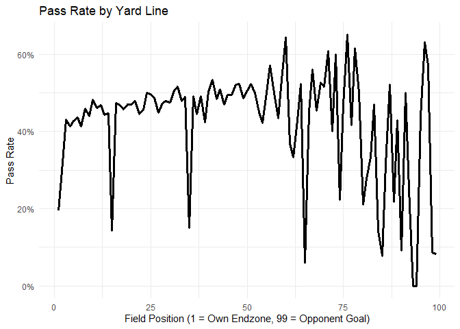<!-- --> - This chart
shows the pass rate by the yard line. The results are fairly consistent
when looking at all plays at all times of the game.

``` r
# Yards Gained by Down

pbp %>%
  filter(Down %in% 1:4, Yards > -20 & Yards < 100) %>%  # removes oddities
  group_by(Down) %>%
  summarize(avg_yards = mean(Yards, na.rm = TRUE)) %>%
  ggplot(aes(factor(Down), avg_yards)) +
  geom_col() +
  labs(
    title = "Average Yards Gained by Down",
    x = "Down",
    y = "Average Yards Gained"
  ) +
  theme_minimal()
```

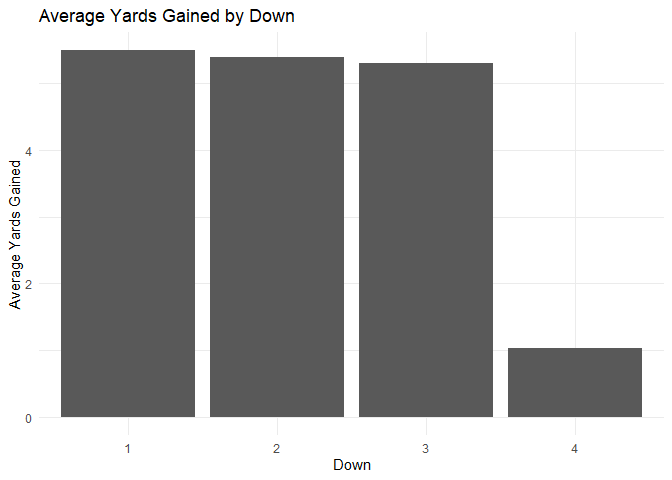<!-- -->

- This chart shows average yards gained per down. 4th down is the clear
  standout here. This is because teams often only need a small amount of
  yards if they are going for it on 4th down.

``` r
# Play Type Frequency (Run, Pass, Sack)

pbp %>%
  mutate(
    play_group = case_when(
      IsPass == 1 ~ "Pass",
      IsRush == 1 ~ "Rush",
      IsSack == 1 ~ "Sack",
      TRUE ~ "Other"
    )
  ) %>%
  count(play_group) %>%
  ggplot(aes(x = reorder(play_group, n), y = n)) +
    geom_col(fill = "steelblue") +
    coord_flip() +
    labs(
      title = "Distribution of Play Types",
      x = "Play Type",
      y = "Count"
    ) +
    theme_minimal()
```

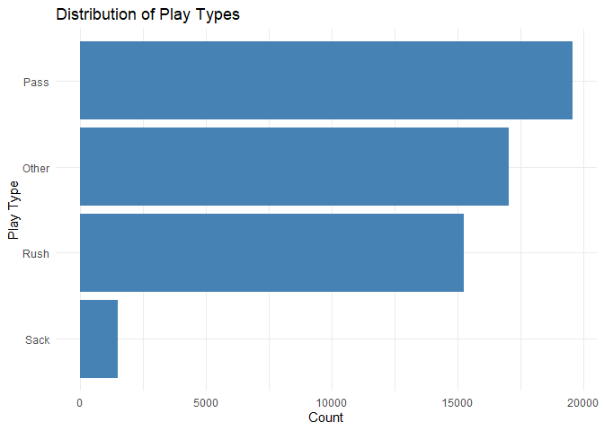<!-- -->

- This chart is a basic analysis on what types of plays are run the most
  often. The league passes the ball more than anything else.

``` r
#Rate of big plays (20 yards or more) by down
pbp %>%
  filter(Down %in% 1:4, !is.na(Yards)) %>%
  mutate(big_play = Yards >= 20) %>%
  group_by(Down) %>%
  summarize(
    big_play_count = sum(big_play),
    total_plays = n(),
    big_play_rate = big_play_count / total_plays
  ) %>%
  ggplot(aes(x = factor(Down), y = big_play_rate)) +
  geom_col() +
  labs(
    title = "Number of Big Plays (20+ Yards) by Down",
    x = "Down",
    y = "Rate of Big Plays"
  ) +
  theme_minimal()
```

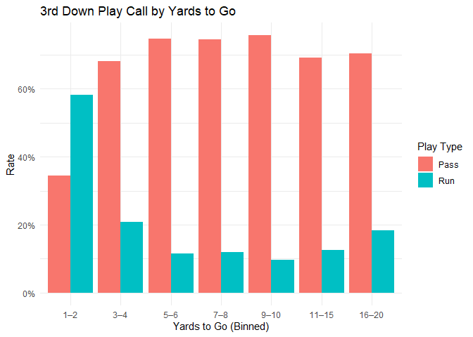<!-- -->

- This chart shows big or “explosive” plays. We can see that the most
  explosive plays happen on 3rd down. This makes sense based on previous
  exploration where we found that teams are passing the ball the most on
  3rd down.

``` r
# Yards to go on third vs likelyhood of run or pass
pbp %>%
  filter(Down == 3, !is.na(ToGo), ToGo > 0, ToGo <= 20) %>%
  mutate(
    togo_bin = cut(
      ToGo,
      breaks = c(0, 2, 4, 6, 8, 10, 15, 20),
      include.lowest = TRUE,
      right = TRUE,
      labels = c("1–2", "3–4", "5–6", "7–8", "9–10", "11–15", "16–20")
    )
  ) %>%
  group_by(togo_bin) %>%
  summarize(
    pass_rate = mean(IsPass == 1, na.rm = TRUE),
    run_rate = mean(IsRush == 1, na.rm = TRUE),
    n_plays = n()
  ) %>%
  pivot_longer(
    cols = c(pass_rate, run_rate),
    names_to = "play_type",
    values_to = "rate"
  ) %>%
  mutate(
    play_type = recode(play_type,
      "pass_rate" = "Pass",
      "run_rate" = "Run")
  ) %>%
  ggplot(aes(x = togo_bin, y = rate, fill = play_type)) +
  geom_col(position = "dodge") +
  labs(
    title = "3rd Down Play Call by Yards to Go",
    x = "Yards to Go (Binned)",
    y = "Rate",
    fill = "Play Type"
  ) +
  scale_y_continuous(labels = scales::percent_format()) +
  theme_minimal()
```

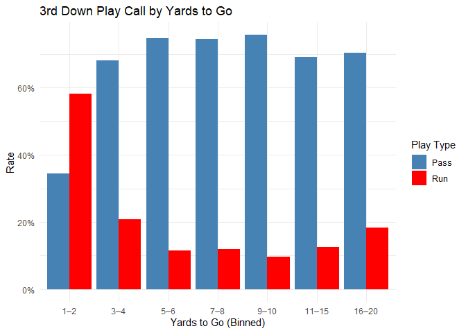<!-- -->

- This chart shows what teams are doing with the ball on 3rd down based
  off of how many yards they need for the first down. We can see that
  running is very popular if they only need a yard or two, but otherwise
  teams are passing the ball.

``` r
# Based on field position, how likely to go for it on 4th
pbp %>%
  filter(Down == 4,
         YardLine >= 1, YardLine <= 99) %>%
  mutate(
    go_for_it = if_else(IsPass == 1 | IsRush == 1, 1L, 0L),
    yard_bin = cut(
      YardLine,
      breaks = seq(0, 100, by = 10),
      include.lowest = TRUE,
      right = TRUE,
      labels = c("1–10", "11–20", "21–30", "31–40", "41–50",
                 "51–60", "61–70", "71–80", "81–90", "91–99")
    )
  ) %>%
  group_by(yard_bin) %>%
  summarize(
    go_rate = mean(go_for_it, na.rm = TRUE),
    n_plays = n()
  ) %>%
  ggplot(aes(x = yard_bin, y = go_rate, group = 1)) +
  geom_line(size = 1.1) +
  geom_point(size = 2) +
  labs(
    title = "Go-For-It Rate on 4th Down by Field Position (Binned)",
    x = "Field Position Bin",
    y = "Go-For-It Rate"
  ) +
  scale_y_continuous(labels = scales::percent_format()) +
  theme_minimal()
```

<!-- -->

- We found the chart above to be very interesting. It’s clear that teams
  are going for it quite often when close to scoring a touchdown.
  However, the spike in the middle of the graph is harder to explain.
  The 71-80 yard line is where the offense generally ends up after a
  kickoff, which happens when the opposing team has just scored. Based
  on this, we can gather that teams are likely to go for it here because
  they often need to answer for their opponent’s recent points,
  especially at the end of the game. There is a sharp drop off after
  teams are within 50 yards from scoring because teams are more likely
  to opt for a field goal in this case.

``` r
#Field goal count by quarter
pbp %>%
  filter(PlayType == "FIELD GOAL") %>%
  count(Quarter) %>%
  ggplot(aes(x = factor(Quarter), y = n)) +
  geom_col() +
  labs(
    title = "Field Goals Attempted by Quarter",
    x = "Quarter",
    y = "Field Goal Attempts"
  ) +
  theme_minimal()
```

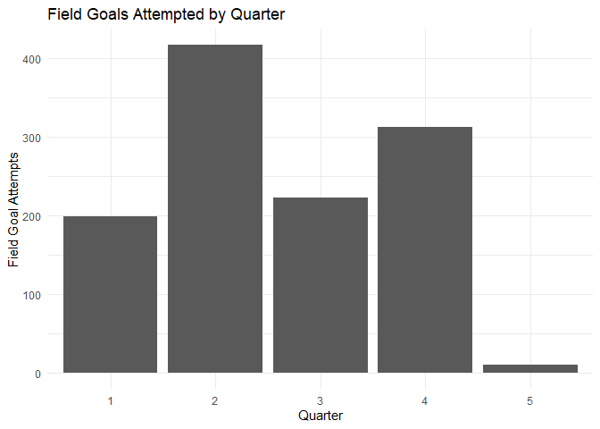<!-- -->

- It’s clear from this chart that field goals are most common in the 2nd
  quarter. This can be explained by teams wanting to get points before
  the half ends.

``` r
#likelyhood of interceptions based on down

pbp %>%
  filter(IsPass == 1, Down %in% 1:4) %>%
  group_by(Down) %>%
  summarize(
    int_rate = mean(IsInterception == 1, na.rm = TRUE),
    n_passes = n()
  ) %>%
  ggplot(aes(x = factor(Down), y = int_rate)) +
  geom_col() +
  labs(
    title = "Interception Rate by Down (Pass Plays Only)",
    x = "Down",
    y = "Interception Rate"
  ) +
  scale_y_continuous(labels = scales::percent_format()) +
  theme_minimal()
```

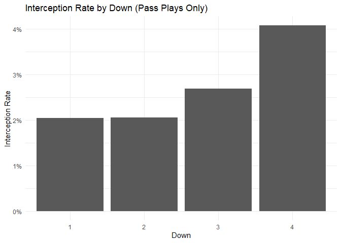<!-- --> - This chart
demonstrates teams experiencing more desparation on 3rd and 4th down.

``` r
# Likelihood of interceptions based on field position 
#Some bins only have a couple interceptions at most so it might not necessarily be the most reliable data
pbp %>%
  filter(IsPass == 1,
         YardLine >= 1, YardLine <= 99) %>%
  mutate(
    yard_bin = cut(
      YardLine,
      breaks = seq(0, 100, by = 10),
      include.lowest = TRUE,
      right = TRUE,
      labels = c("1–10", "11–20", "21–30", "31–40", "41–50",
                 "51–60", "61–70", "71–80", "81–90", "91–99")
    )
  ) %>%
  group_by(yard_bin) %>%
  summarize(
    int_rate = mean(IsInterception == 1, na.rm = TRUE),
    n_passes = n()
  ) %>%
  ggplot(aes(x = yard_bin, y = int_rate, group = 1)) +
  geom_line(size = 1.1) +
  geom_point(size = 2) +
  labs(
    title = "Interception Rate by Field Position (Pass Plays Only, Binned)",
    x = "Field Position Bin",
    y = "Interception Rate"
  ) +
  scale_y_continuous(labels = scales::percent_format()) +
  theme_minimal()
```

<!-- -->

- This chart shows the interception rate based on where the offense is
  on the field. When very close to their own endzone, teams are rarely
  throwing interceptions. This is becasue they are rarely throwing in
  general because it is a dangerous area of the field.

``` r
#Tracking "success" by using the 40%,60%,100% rule

pbp %>%
  filter(Down %in% 1:4) %>%
  mutate(
    success = case_when(
      Down == 1 ~ Yards >= 0.4 * ToGo,
      Down == 2 ~ Yards >= 0.6 * ToGo,
      Down %in% 3:4 ~ Yards >= ToGo
    )
  ) %>%
  group_by(Down) %>%
  summarize(success_rate = mean(success, na.rm = TRUE)) %>%
  ggplot(aes(factor(Down), success_rate)) +
  geom_col() +
  scale_y_continuous(labels = scales::percent_format()) +
  labs(title="Success Rate by Down", x="Down", y="Success Rate")
```

<!-- --> - This chart
illustrates that teams are most successful on 1st down.

``` r
#Pass rate by Downs and Distance (excluding plays with more than 20 yards till first down/touchdown)
pbp %>%
  filter(Down %in% 1:4, ToGo <= 20) %>%
  group_by(Down, ToGo) %>%
  summarize(pass_rate = mean(IsPass == 1), .groups="drop") %>%
  ggplot(aes(ToGo, factor(Down), fill = pass_rate)) +
  geom_tile() +
  scale_fill_viridis_c(labels = scales::percent) +
  labs(title="Pass Rate Heatmap by Down & Distance",
       x="Yards to Go", y="Down", fill="Pass Rate")
```

<!-- -->

- This heatmap is another illustration of teams passing vs. running the
  ball based on down and distance. 4th down stands out because teams do
  not pass nearly as often here.

## Diving Deeper: Analyzing what makes a team successful

- Identify the top and bottom 5 Teams and Filter Data

``` r
# Calculate wins per team from final_scores
team_wins <- final_scores %>%
  mutate(
    Winner = case_when(
      Score1 > Score2 ~ Team1,
      Score2 > Score1 ~ Team2,
      TRUE ~ "Tie"
    )
  ) %>%
  filter(Winner != "Tie") %>%
  count(Winner, name = "n_wins")

# Create the bar chart
team_wins %>%
  ggplot(aes(x = reorder(Winner, n_wins), y = n_wins)) +
  geom_col(fill = "steelblue") +
  coord_flip() +
  labs(
    title = "Total Wins by Team",
    x = "Team",
    y = "Number of Wins"
  ) +
  geom_text(aes(label = n_wins), hjust = -0.2, size = 3) +
  theme_minimal()
```

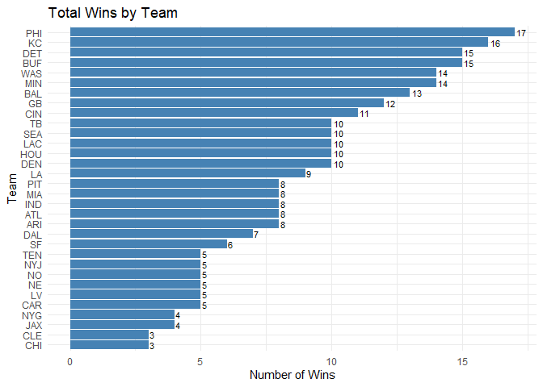<!-- -->

- Wins is a good stat to determine the the strength of teams, but there
  is a better stat: point differential.
- Point differential shows Points Scored minus Points Allowed. This
  better accounts for things like strength of schedule.

``` r
# Calculate Point Differential for ALL 32 Teams
all_team_differential <- final_scores %>%
  select(GameId, Team = Team1, PointsFor = Score1, PointsAgainst = Score2) %>%
  bind_rows(
    final_scores %>%
      select(GameId, Team = Team2, PointsFor = Score2, PointsAgainst = Score1)
  ) %>%
  group_by(Team) %>%
  summarize(
    PointDiff = sum(PointsFor, na.rm = TRUE) - sum(PointsAgainst, na.rm = TRUE),
    .groups = "drop"
  )

# Create the Chart
all_team_differential %>%
  ggplot(aes(x = reorder(Team, PointDiff), y = PointDiff, fill = PointDiff > 0)) +
  geom_col() +
  coord_flip() +
  scale_fill_manual(values = c("FALSE" = "#D55E00", "TRUE" = "#0072B2"), 
                    labels = c("Negative", "Positive"), 
                    name = "Differential") +
  labs(
    title = "Total Point Differential by Team",
    x = "Team",
    y = "Point Differential"
  ) +
  theme_minimal()
```

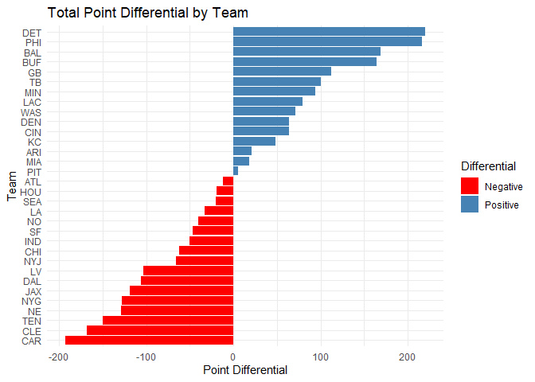<!-- -->

``` r
# --- 1. Calculate Point Differential ---
team_differential <- final_scores %>%
  select(GameId, Team = Team1, PointsFor = Score1, PointsAgainst = Score2) %>%
  bind_rows(
    final_scores %>%
      select(GameId, Team = Team2, PointsFor = Score2, PointsAgainst = Score1)
  ) %>%
  group_by(Team) %>%
  summarize(
    PointDiff = sum(PointsFor, na.rm = TRUE) - sum(PointsAgainst, na.rm = TRUE),
    .groups = "drop"
  ) %>%
  arrange(desc(PointDiff))

# --- 2. Define Top 5 and Bottom 5 Teams ---
top_teams <- team_differential %>% slice_head(n = 5) %>% pull(Team)
bottom_teams <- team_differential %>% slice_tail(n = 5) %>% pull(Team)

# --- 3. Filter PBP Data ---
top_games <- final_scores %>% filter(Team1 %in% top_teams | Team2 %in% top_teams)
top_5_offense <- pbp %>%
  semi_join(top_games, by = "GameId") %>%
  filter(OffenseTeam %in% top_teams) %>%
  mutate(Group = "Top 5 (Best Diff)")

bottom_games <- final_scores %>% filter(Team1 %in% bottom_teams | Team2 %in% bottom_teams)
bottom_5_offense <- pbp %>%
  semi_join(bottom_games, by = "GameId") %>%
  filter(OffenseTeam %in% bottom_teams) %>%
  mutate(Group = "Bottom 5 (Worst Diff)")

# --- 4. Combine into one Master Dataset ---
combined_offense <- bind_rows(top_5_offense, bottom_5_offense) %>%
  mutate(Group = factor(Group, levels = c("Top 5 (Best Diff)", "Bottom 5 (Worst Diff)")))
```

- Offensive Efficiency Chart

``` r
# Calculate Stats
efficiency_stats <- combined_offense %>%
  group_by(Group, OffenseTeam) %>%
  summarize(YPP = mean(Yards, na.rm = TRUE), .groups = "drop")

# Plot
efficiency_stats %>%
  ggplot(aes(x = reorder(OffenseTeam, YPP), y = YPP, fill = Group)) +
  geom_col() +
  coord_flip() +
  facet_wrap(~Group, scales = "free_y") +  # This creates the side-by-side view
  scale_fill_manual(values = c("steelblue", "firebrick")) +
  labs(
    title = "Offensive Efficiency: Top 5 vs Bottom 5",
    subtitle = "Average Yards Per Play",
    x = "Team",
    y = "Yards Per Play"
  ) +
  theme_minimal() +
  theme(legend.position = "none")
```

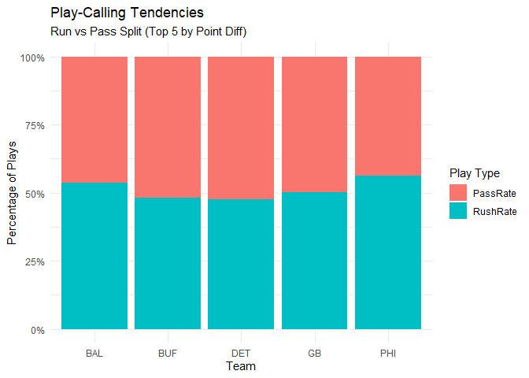<!-- -->

``` r
# 1. Calculate Point Differential for ALL teams
team_differential <- final_scores %>%
  select(GameId, Team = Team1, PointsFor = Score1, PointsAgainst = Score2) %>%
  bind_rows(
    final_scores %>%
      select(GameId, Team = Team2, PointsFor = Score2, PointsAgainst = Score1)
  ) %>%
  group_by(Team) %>%
  summarize(
    PointDiff = sum(PointsFor, na.rm = TRUE) - sum(PointsAgainst, na.rm = TRUE),
    .groups = "drop"
  )

# 2. Calculate Yards Per Play (YPP) for ALL teams
team_ypp <- pbp %>%
  group_by(OffenseTeam) %>%
  summarize(
    YPP = mean(Yards, na.rm = TRUE),
    .groups = "drop"
  )

# 3. Join the data
team_scatter_data <- team_differential %>%
  inner_join(team_ypp, by = c("Team" = "OffenseTeam"))

# 4. Create Scatter Plot with Best Fit Line
team_scatter_data %>%
  ggplot(aes(x = PointDiff, y = YPP)) +
  # Add the best fit line (linear model) first so points sit on top
  geom_smooth(method = "lm", color = "red", se = FALSE) +
  # Add points
  geom_point(color = "steelblue", size = 3) +
  # Add team labels
  geom_text(aes(label = Team), vjust = -1, size = 3, check_overlap = TRUE) +
  labs(
    title = "Yards Per Play vs. Point Differential",
    subtitle = "2024 NFL Regular Season",
    x = "Point Differential",
    y = "Yards Per Play (Offense)"
  ) +
  theme_minimal()
```

    ## `geom_smooth()` using formula = 'y ~ x'

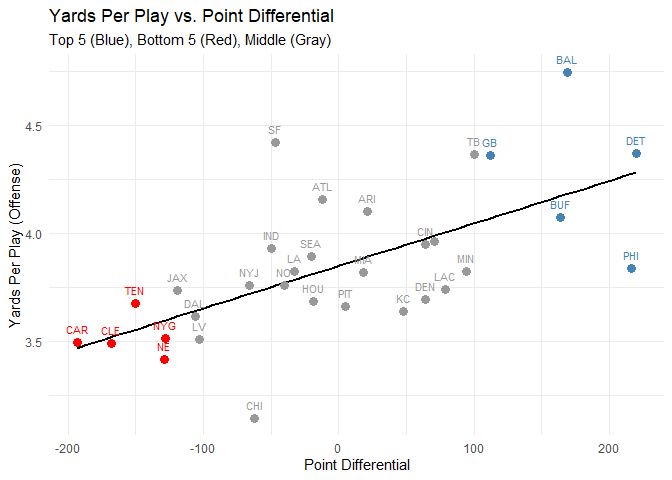<!-- -->

- Play-Calling Tendencies Chart

``` r
# Calculate Tendencies
play_tendencies <- combined_offense %>%
  group_by(Group, OffenseTeam) %>%
  summarize(
    PassRate = mean(IsPass == 1, na.rm = TRUE),
    RushRate = mean(IsRush == 1, na.rm = TRUE),
    .groups = "drop"
  ) %>%
  pivot_longer(cols = c(PassRate, RushRate), names_to = "Type", values_to = "Rate")

# Plot
play_tendencies %>%
  ggplot(aes(x = OffenseTeam, y = Rate, fill = Type)) +
  geom_col(position = "fill") +
  coord_flip() +
  facet_wrap(~Group, scales = "free_y") +
  scale_y_continuous(labels = scales::percent) +
  labs(
    title = "Play-Calling Tendencies",
    subtitle = "Pass (Blue) vs Run (Red) Ratios",
    x = "Team",
    y = "Percentage",
    fill = "Play Type"
  ) +
  theme_minimal()
```

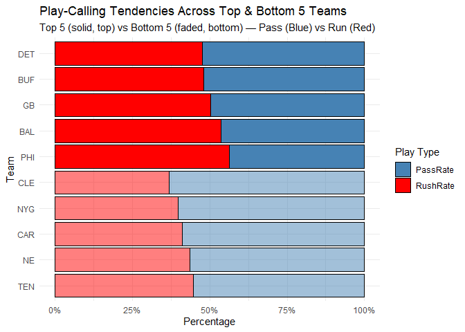<!-- -->

``` r
# 1. Calculate Pass Rate for ALL teams
team_pass_rate <- pbp %>%
  group_by(OffenseTeam) %>%
  summarize(
    PassRate = mean(IsPass == 1, na.rm = TRUE),
    .groups = "drop"
  )

# 2. Join with Point Differential (Calculated in previous step)
pass_scatter_data <- team_differential %>%
  inner_join(team_pass_rate, by = c("Team" = "OffenseTeam"))

# 3. Create Scatter Plot
pass_scatter_data %>%
  ggplot(aes(x = PointDiff, y = PassRate)) +
  geom_smooth(method = "lm", color = "red", se = FALSE) +
  geom_point(color = "darkgreen", size = 3) +
  geom_text(aes(label = Team), vjust = -1, size = 3, check_overlap = TRUE) +
  scale_y_continuous(labels = scales::percent) +
  labs(
    title = "Pass Rate vs. Point Differential",
    subtitle = "Do bad teams pass more because they have to?",
    x = "Point Differential",
    y = "Overall Pass Rate"
  ) +
  theme_minimal()
```

    ## `geom_smooth()` using formula = 'y ~ x'

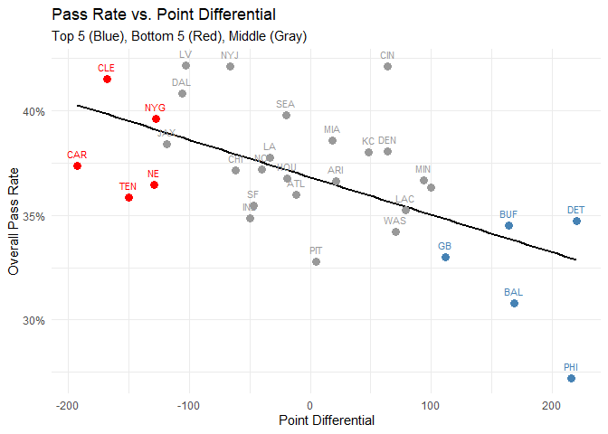<!-- -->

- Down Efficiency Chart

``` r
# Calculate 3rd Down Stats
down_stats <- combined_offense %>%
  filter(Down == 3) %>%
  group_by(Group, OffenseTeam) %>%
  summarize(SuccessRate = mean(Yards > 0, na.rm = TRUE), .groups = "drop")

# Plot
down_stats %>%
  ggplot(aes(x = reorder(OffenseTeam, SuccessRate), y = SuccessRate, fill = Group)) +
  geom_col() +
  coord_flip() +
  facet_wrap(~Group, scales = "free_y") +
  scale_fill_manual(values = c("steelblue", "firebrick")) +
  scale_y_continuous(labels = scales::percent) +
  labs(
    title = "3rd Down Success Rate",
    subtitle = "Percentage of plays gaining yards on 3rd down",
    x = "Team",
    y = "Success Rate"
  ) +
  theme_minimal() +
  theme(legend.position = "none")
```

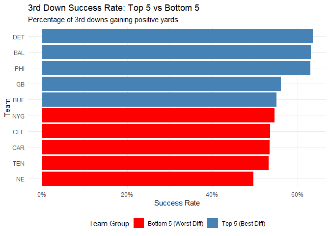<!-- -->

``` r
# 1. Calculate 3rd Down Conversion Rate for ALL teams
team_3rd_down <- pbp %>%
  filter(Down == 3) %>%
  group_by(OffenseTeam) %>%
  summarize(
    # Success = Gaining enough yards for a 1st Down (or TD)
    ConversionRate = mean(Yards >= ToGo, na.rm = TRUE),
    .groups = "drop"
  )

# 2. Join with Point Differential
efficiency_scatter_data <- team_differential %>%
  inner_join(team_3rd_down, by = c("Team" = "OffenseTeam"))

# 3. Create Scatter Plot
efficiency_scatter_data %>%
  ggplot(aes(x = PointDiff, y = ConversionRate)) +
  geom_smooth(method = "lm", color = "red", se = FALSE) +
  geom_point(color = "purple", size = 3) +
  geom_text(aes(label = Team), vjust = -1, size = 3, check_overlap = TRUE) +
  scale_y_continuous(labels = scales::percent) +
  labs(
    title = "3rd Down Conversion Rate vs. Point Differential",
    subtitle = "Better teams sustain drives.",
    x = "Point Differential",
    y = "3rd Down Conversion Rate"
  ) +
  theme_minimal()
```

    ## `geom_smooth()` using formula = 'y ~ x'

<!-- -->

- 4th Quarter Efficiency (Game End Pressure)

``` r
# --- Metric 2: 4th Quarter YPP ---

# 1. Calculate for ALL Teams
q4_stats_all <- pbp %>%
  filter(Quarter == 4) %>%
  group_by(OffenseTeam) %>%
  summarize(Q4_YPP = mean(Yards, na.rm = TRUE), .groups = "drop")

# Join
q4_scatter_data <- team_differential %>% inner_join(q4_stats_all, by = c("Team" = "OffenseTeam"))

# Scatter Plot
ggplot(q4_scatter_data, aes(x = PointDiff, y = Q4_YPP)) +
  geom_smooth(method = "lm", color = "red", se = FALSE) +
  geom_point(color = "purple", size = 3) +
  geom_text(aes(label = Team), vjust = -1, size = 3, check_overlap = TRUE) +
  labs(title = "4th Quarter YPP vs. Point Differential", subtitle = "Offensive performance in the final quarter",
       x = "Point Differential", y = "4th Quarter Yards/Play") + theme_minimal()
```

    ## `geom_smooth()` using formula = 'y ~ x'

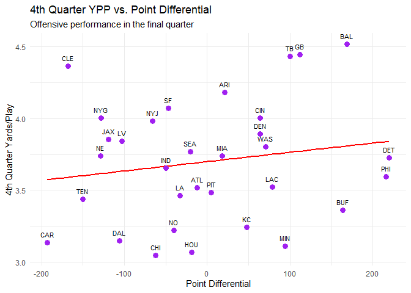<!-- -->

``` r
# 2. Bar Chart
combined_offense %>%
  filter(Quarter == 4) %>%
  group_by(Group, OffenseTeam) %>%
  summarize(Q4_YPP = mean(Yards, na.rm = TRUE), .groups = "drop") %>%
  ggplot(aes(x = reorder(OffenseTeam, Q4_YPP), y = Q4_YPP, fill = Group)) +
  geom_col() + coord_flip() + facet_wrap(~Group, scales = "free_y") +
  scale_fill_manual(values = c("steelblue", "firebrick")) +
  labs(title = "4th Quarter Efficiency (Top 5 vs Bottom 5)", subtitle = "Yards Per Play in Q4",
       x = "Team", y = "Yards Per Play") + theme_minimal() + theme(legend.position = "none")
```

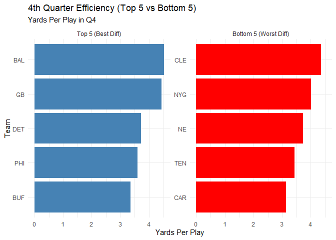<!-- -->

- “2-Minute Drill” Efficiency (Clock Pressure)

``` r
# --- Metric 3: 2-Minute Drill Efficiency ---

# 1. Calculate for ALL Teams
two_min_stats_all <- pbp %>%
  filter((Quarter == 2), Minute <= 2) %>%
  group_by(OffenseTeam) %>%
  summarize(TwoMin_YPP = mean(Yards, na.rm = TRUE), .groups = "drop")

# Join
two_min_scatter_data <- team_differential %>% inner_join(two_min_stats_all, by = c("Team" = "OffenseTeam"))

# Scatter Plot
ggplot(two_min_scatter_data, aes(x = PointDiff, y = TwoMin_YPP)) +
  geom_smooth(method = "lm", color = "red", se = FALSE) +
  geom_point(color = "orange", size = 3) +
  geom_text(aes(label = Team), vjust = -1, size = 3, check_overlap = TRUE) +
  labs(title = "2-Minute Drill YPP vs. Point Differential", subtitle = "Performance in last 2 mins of first half",
       x = "Point Differential", y = "2-Min Drill Yards/Play") + theme_minimal()
```

    ## `geom_smooth()` using formula = 'y ~ x'

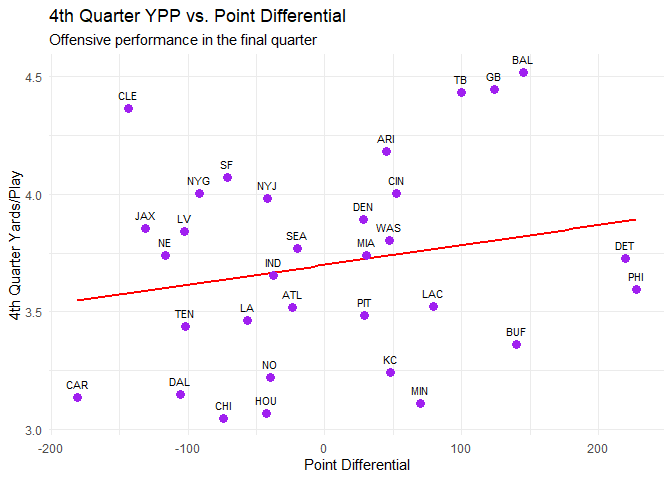<!-- -->

``` r
# 2. Bar Chart
combined_offense %>%
  filter((Quarter == 2), Minute <= 2) %>%
  group_by(Group, OffenseTeam) %>%
  summarize(TwoMin_YPP = mean(Yards, na.rm = TRUE), .groups = "drop") %>%
  ggplot(aes(x = reorder(OffenseTeam, TwoMin_YPP), y = TwoMin_YPP, fill = Group)) +
  geom_col() + coord_flip() + facet_wrap(~Group, scales = "free_y") +
  scale_fill_manual(values = c("steelblue", "firebrick")) +
  labs(title = "2-Minute Drill Efficiency (Top 5 vs Bottom 5)", subtitle = "Yards Per Play (Last 2 mins of Q2/Q4)",
       x = "Team", y = "Yards Per Play") + theme_minimal() + theme(legend.position = "none")
```

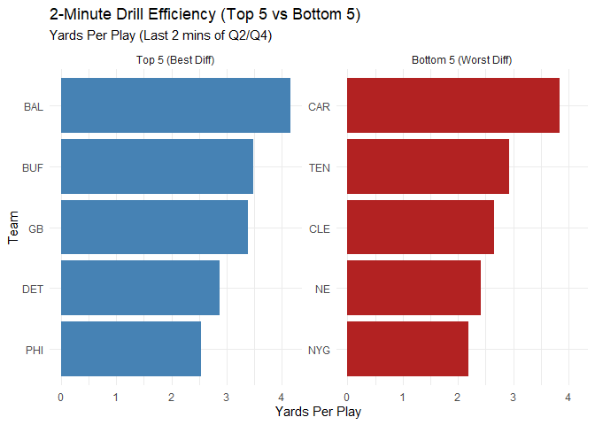<!-- -->

- Explosive Play Rate (Big Play Ability)

``` r
# --- Metric 4: Explosive Play Rate ---

# 1. Calculate for ALL Teams
explosive_stats_all <- pbp %>%
  group_by(OffenseTeam) %>%
  summarize(ExplosiveRate = mean(Yards >= 20, na.rm = TRUE), .groups = "drop")

# Join
explosive_scatter_data <- team_differential %>% inner_join(explosive_stats_all, by = c("Team" = "OffenseTeam"))

# 2. Bar Chart
combined_offense %>%
  group_by(Group, OffenseTeam) %>%
  summarize(ExplosiveRate = mean(Yards >= 20, na.rm = TRUE), .groups = "drop") %>%
  ggplot(aes(x = reorder(OffenseTeam, ExplosiveRate), y = ExplosiveRate, fill = Group)) +
  geom_col() + coord_flip() + facet_wrap(~Group, scales = "free_y") +
  scale_fill_manual(values = c("steelblue", "firebrick")) +
  scale_y_continuous(labels = scales::percent) +
  labs(title = "Explosive Play Rate (Top 5 vs Bottom 5)", subtitle = "% of plays gaining 20+ Yards",
       x = "Team", y = "Explosive Rate") + theme_minimal() + theme(legend.position = "none")
```

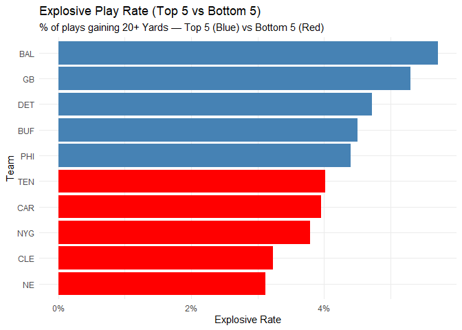<!-- -->

``` r
# Scatter Plot
ggplot(explosive_scatter_data, aes(x = PointDiff, y = ExplosiveRate)) +
  geom_smooth(method = "lm", color = "red", se = FALSE) +
  geom_point(color = "darkgreen", size = 3) +
  geom_text(aes(label = Team), vjust = -1, size = 3, check_overlap = TRUE) +
  scale_y_continuous(labels = scales::percent) +
  labs(title = "Explosive Play Rate vs. Point Differential", subtitle = "% of plays gaining 20+ Yards",
       x = "Point Differential", y = "Explosive Play Rate") + theme_minimal()
```

    ## `geom_smooth()` using formula = 'y ~ x'

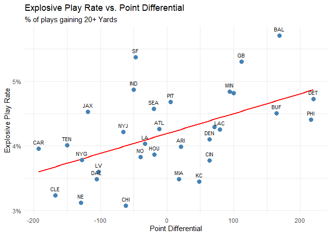<!-- --> \##
Defensive Statistics

- Field Position Chart

``` r
# Calculate Field Position
field_stats <- combined_offense %>%
  group_by(Group, OffenseTeam) %>%
  summarize(AvgStart = mean(YardLine, na.rm = TRUE), .groups = "drop")

# Plot
field_stats %>%
  ggplot(aes(x = reorder(OffenseTeam, AvgStart), y = AvgStart, color = Group)) +
  geom_point(size = 4) +
  geom_segment(aes(x = OffenseTeam, xend = OffenseTeam, y = 0, yend = AvgStart)) +
  coord_flip() +
  facet_wrap(~Group, scales = "free_y") +
  scale_color_manual(values = c("steelblue", "firebrick")) +
  labs(
    title = "Average Starting Field Position",
    x = "Team",
    y = "Yard Line"
  ) +
  theme_minimal() +
  theme(legend.position = "none")
```

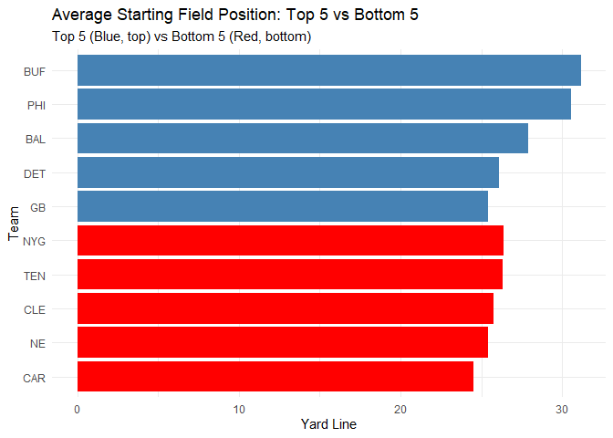<!-- -->

``` r
# --- Create Defensive Dataset using EXISTING top/bottom lists ---

top_teams <- team_differential %>% slice_head(n = 5) %>% pull(Team)
bottom_teams <- team_differential %>% slice_tail(n = 5) %>% pull(Team)

# Filter PBP for when the Top 5 Point-Diff teams are on DEFENSE
top_5_defense <- pbp %>%
  filter(DefenseTeam %in% top_teams) %>%
  mutate(Group = "Top 5 (Best Diff)")

# Filter PBP for when the Bottom 5 Point-Diff teams are on DEFENSE
bottom_5_defense <- pbp %>%
  filter(DefenseTeam %in% bottom_teams) %>%
  mutate(Group = "Bottom 5 (Worst Diff)")

# Combine into one Master Defense Dataset
combined_defense <- bind_rows(top_5_defense, bottom_5_defense) %>%
  mutate(Group = factor(Group, levels = c("Top 5 (Best Diff)", "Bottom 5 (Worst Diff)")))
```

``` r
# Calculate Yards Allowed
defense_ypp <- combined_defense %>%
  group_by(Group, DefenseTeam) %>%
  summarize(YardsAllowed = mean(Yards, na.rm = TRUE), .groups = "drop")

# Plot
defense_ypp %>%
  ggplot(aes(x = reorder(DefenseTeam, -YardsAllowed), y = YardsAllowed, fill = Group)) +
  geom_col() +
  coord_flip() +
  facet_wrap(~Group, scales = "free_y") +
  scale_fill_manual(values = c("forestgreen", "firebrick")) +
  labs(
    title = "Defensive Efficiency: Yards Allowed Per Play",
    subtitle = "Lower is Better (Do best teams also have best defenses?)",
    x = "Team",
    y = "Avg Yards Allowed"
  ) +
  theme_minimal() +
  theme(legend.position = "none")
```

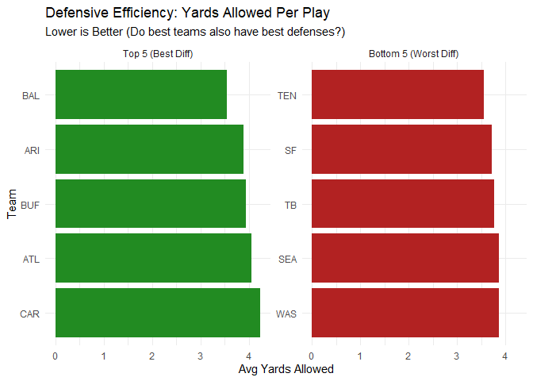<!-- -->

``` r
defense_ypp_all <- pbp %>%
  group_by(DefenseTeam) %>%
  summarize(YardsAllowed = mean(Yards, na.rm = TRUE), .groups = "drop")

# Join: ALL teams' defensive YPP with point differential
defense_scatter_data <- team_differential %>%
  inner_join(defense_ypp_all, by = c("Team" = "DefenseTeam"))

# Scatter Plot: Yards Allowed vs Point Differential
ggplot(defense_scatter_data, aes(x = PointDiff, y = YardsAllowed)) +
  geom_smooth(method = "lm", color = "red", se = FALSE) +
  geom_point(color = "darkgreen", size = 3) +
  geom_text(aes(label = Team), vjust = -1, size = 3, check_overlap = TRUE) +
  labs(
    title = "Defensive Yards Allowed vs. Point Differential",
    subtitle = "Lower Yards Allowed = Better Defense",
    x = "Point Differential",
    y = "Avg Yards Allowed Per Play"
  ) +
  theme_minimal()
```

    ## `geom_smooth()` using formula = 'y ~ x'

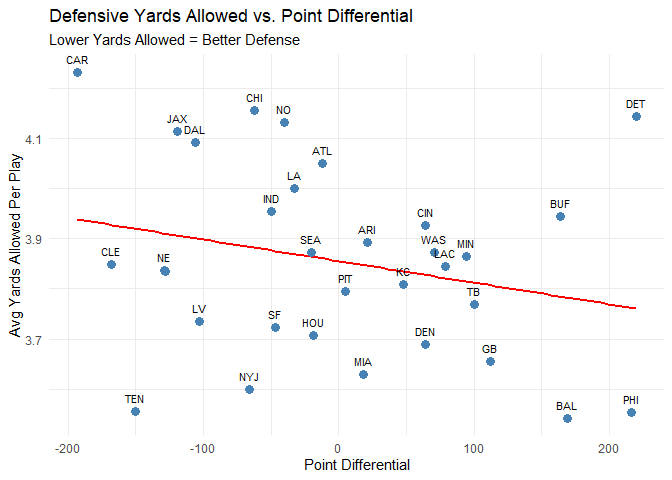<!-- -->

``` r
# Calculate Havoc Rate (Sacks + INTs per Dropback)
havoc_stats <- combined_defense %>%
  # Filter for passing plays (dropbacks)
  filter(IsPass == 1 | IsSack == 1) %>%
  group_by(Group, DefenseTeam) %>%
  summarize(
    Dropbacks = n(),
    HavocPlays = sum(IsSack == 1 | IsInterception == 1, na.rm = TRUE),
    HavocRate = HavocPlays / Dropbacks,
    .groups = "drop"
  )

# Plot
havoc_stats %>%
  ggplot(aes(x = reorder(DefenseTeam, HavocRate), y = HavocRate, fill = Group)) +
  geom_col() +
  coord_flip() +
  facet_wrap(~Group, scales = "free_y") +
  scale_fill_manual(values = c("forestgreen", "firebrick")) +
  scale_y_continuous(labels = scales::percent) +
  labs(
    title = "Havoc Rate: Sacks & Interceptions",
    subtitle = "Percentage of dropbacks resulting in a Sack or INT",
    x = "Team",
    y = "Havoc Rate"
  ) +
  theme_minimal() +
  theme(legend.position = "none")
```

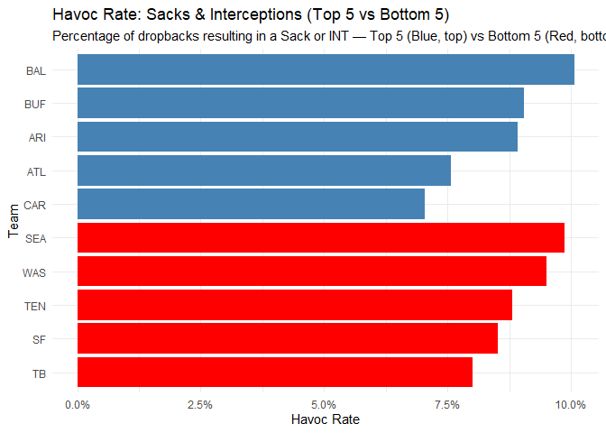<!-- -->
